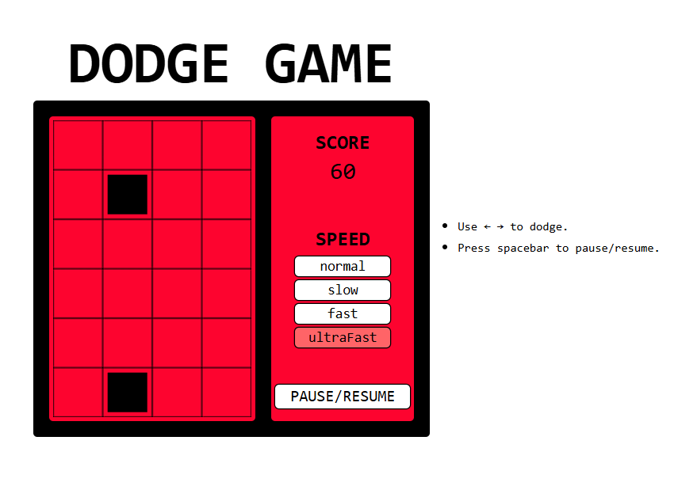

# 🎮 Dodge Game


A simple and fun dodge game where you avoid falling obstacles and try to survive as long as possible.  
Built with **TypeScript** and styled using **Tailwind CSS**.

## 🚀 Features
- Smooth gameplay with responsive controls
- Dynamic difficulty with multiple speed options
- Simple UI with Tailwind styling
- Written in TypeScript for type safety and maintainability

## 🎮 Controls
- **Arrow Keys (left/right)** → Move player  
- **Spacebar** → Pause/Resume the game  

## 🛠️ Tech Stack
- **TypeScript** – for game logic  
- **Tailwind CSS** – for styling  
- **HTML Canvas** – for rendering  

## 📦 Getting Started
```bash
git clone https://github.com/manojpatra061/dodge-game.git

cd dodge-game

npm install

npm run dev
